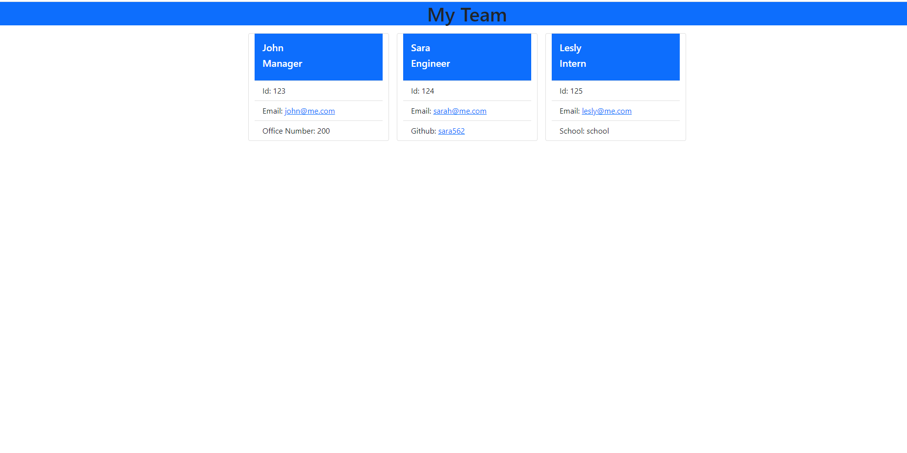

# Employee Roster

    
## Description 
Employee Roster takes employee information and displays it in a team webpage for employer reference. The employee has to enter personal information like name, ID, email, github etc.. to then create a employee profile(section) with their information.
The image down below shows the representation of this projects objective. 

## Table of Content
- [Installation](#installation)
- [Usage](#usage)
- [Test](#test)

## Installations
The following is necessary to run this application: An "npm install" has to be done in order to get this application running.

## Usage
This app can be used to keep track of team members in a business.
 
## Test
The following is needed to run the test:
-Node index.js has to be called on the terminal once git has been cloned.
-Answer all the prompt questions.
-Open browser to see results. 
    

